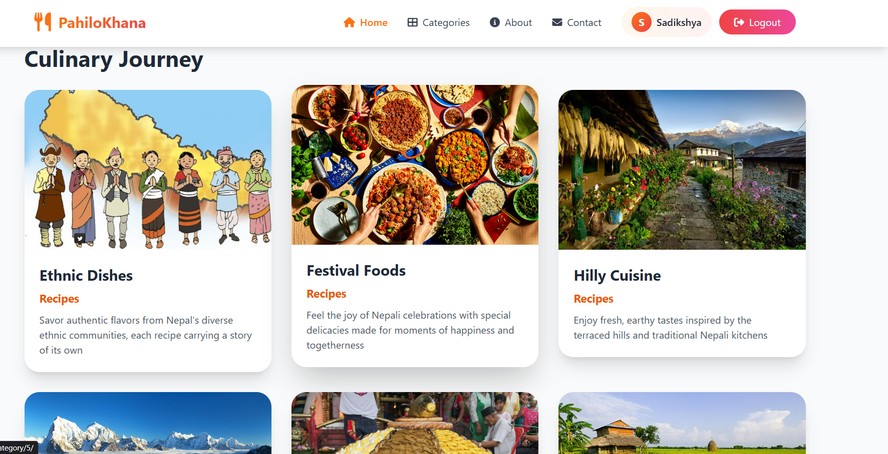
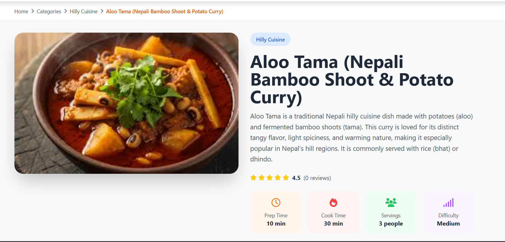
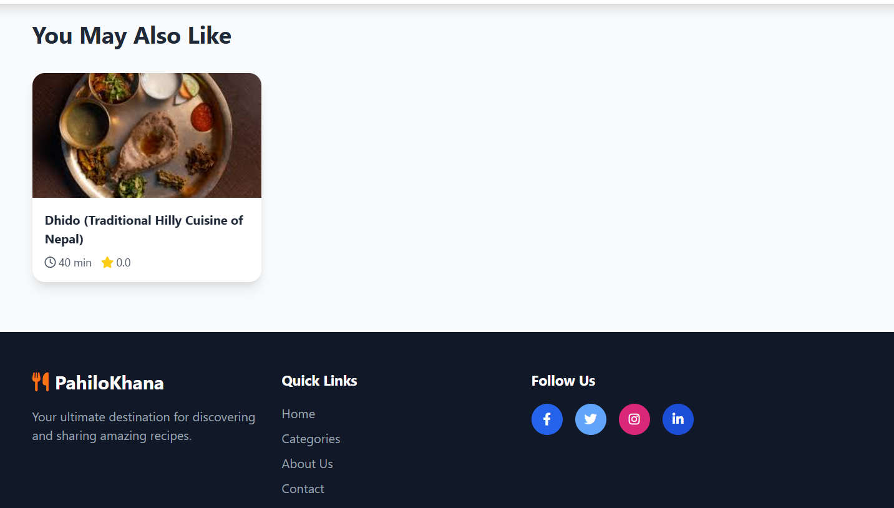
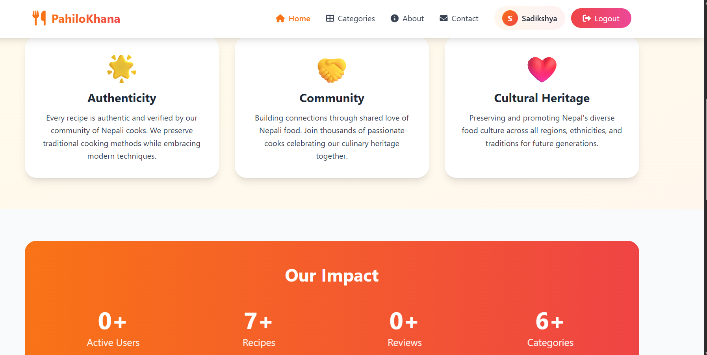

# Nepali Kitchen Recipes 🍛

A Django web application for sharing and discovering authentic Nepali recipes.

## Features

- User authentication and profiles
- Create, edit, and share recipes
- Upload recipe images
- Responsive design

## Tech Stack

- Django (Python)
- SQLite
- HTML/CSS/JavaScript


## Screenshots

### Home Page


### Recipe Categories


### Recipe Details


### Single Recipe View


### Related Recipes


### About Page


### Contact Page


## Quick Start

1. **Clone and setup**
   ```bash
   git clone https://github.com/Sadikshya-dhakal/Nepali-Kitchen-Recipes.git
   cd Nepali-Kitchen-Recipes
   python -m venv venv
   source venv/bin/activate  # On Windows: venv\Scripts\activate
   pip install -r requirements.txt
   ```

2. **Run migrations and start server**
   ```bash
   python manage.py migrate
   python manage.py createsuperuser
   python manage.py runserver
   ```

3. **Access the app**
   - Website: `http://127.0.0.1:8000/`
   - Admin: `http://127.0.0.1:8000/admin/`

## Contributing

Contributions welcome! Fork the repo and submit a pull request.

## Author

**Sadikshya Dhakal** - [@Sadikshya-dhakal](https://github.com/Sadikshya-dhakal)

## License

MIT License

---

*Preserving Nepali culinary traditions, one recipe at a time.* 🍲
